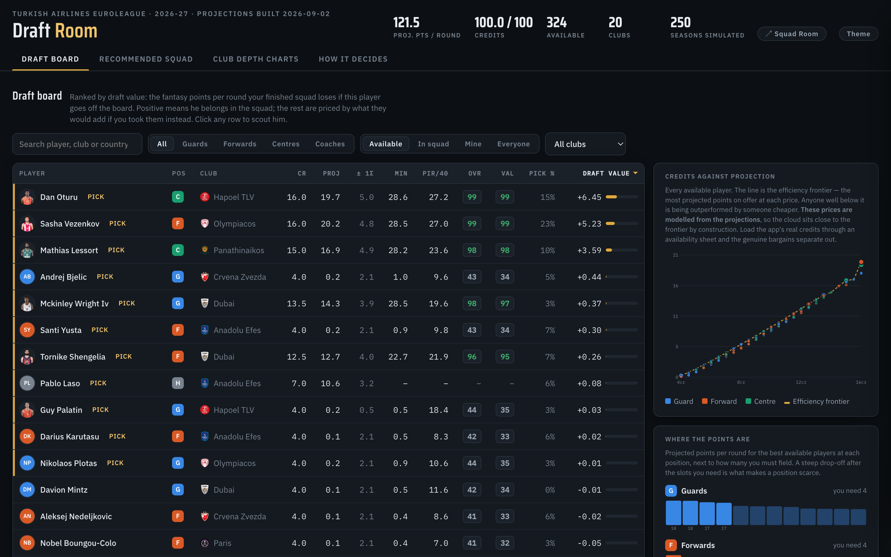
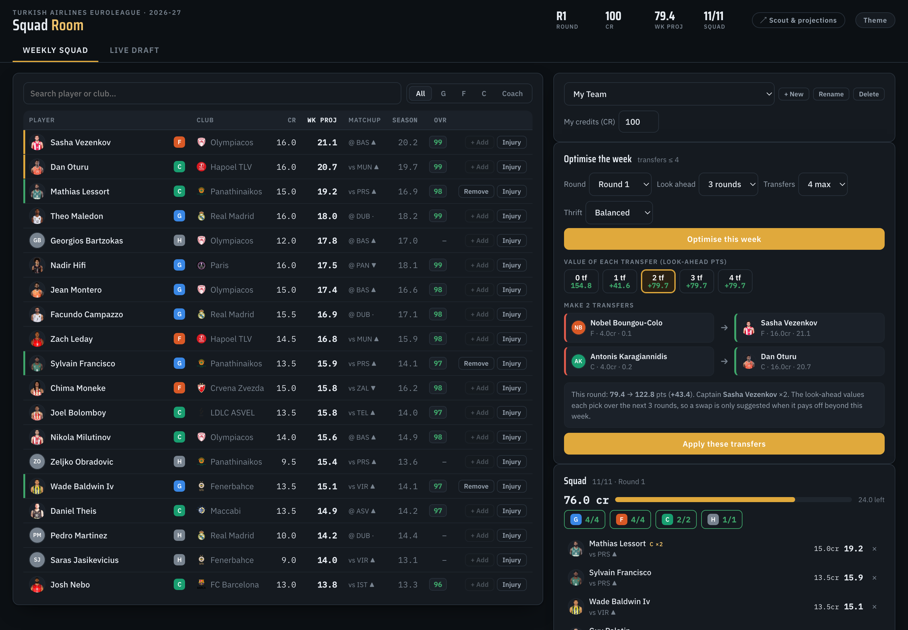
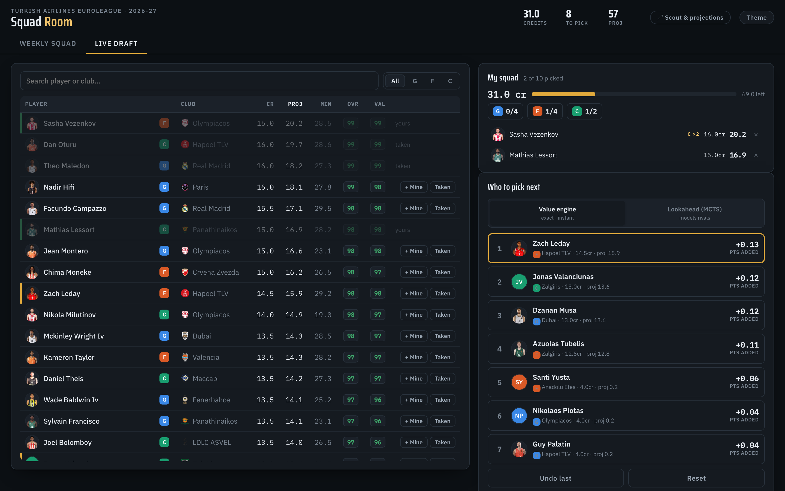
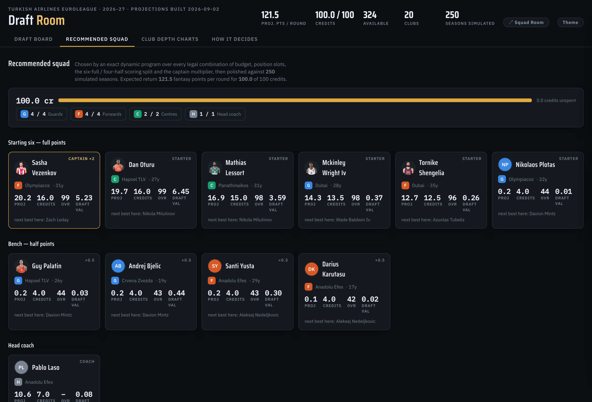
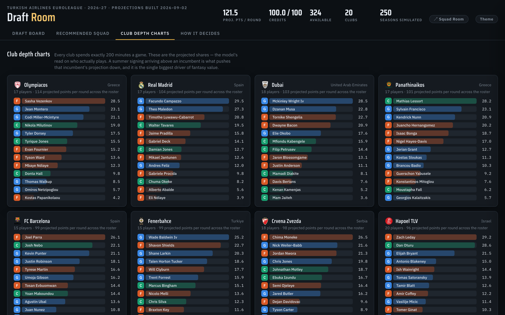
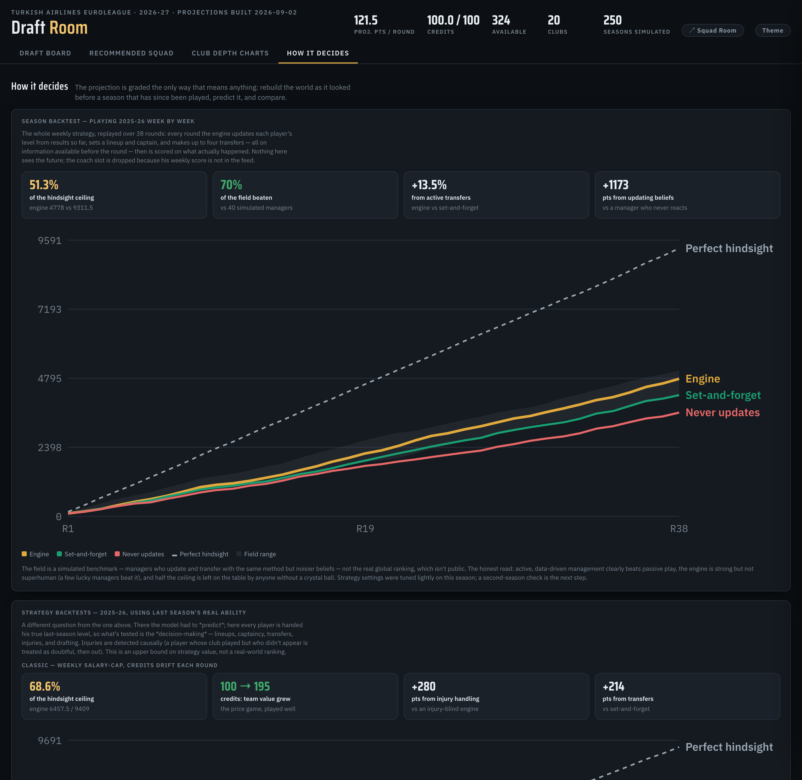

<div align="center">

# 🏀 Draft Room

### Advanced-analytics squad building for the EuroLeague Fantasy Challenge

Real data · an **exact** squad optimiser · an **AlphaZero-style draft lookahead** · a **matchup-aware weekly transfer engine** — all validated with three honest backtests.

</div>



---

Draft Room is an end-to-end system for the [EuroLeague Fantasy Challenge](https://www.euroleaguebasketball.net/en/euroleague/fantasy/). It pulls live rosters, four seasons of EuroLeague/EuroCup stats, every box score, and three NBA seasons; projects every player on a current roster; prices them; and then answers the two questions the game actually asks:

- **Who do I draft**, given who's already off the board? (exclusive draft leagues)
- **Which transfers do I make this week**, given my squad, my budget, injuries and the fixtures? (the salary-cap "classic" game)

Nothing is hand-entered — the whole pipeline runs from public feeds. And every claim is backed by a measurement, including the ones where the fancy algorithm *didn't* win.

## Two apps, three tools

| | |
|---|---|
| **Scout & Analysis** | Projections, FM/2K-style scouting radars, club depth charts, the price/projection frontier, and three backtests. |
| **Squad Room — Weekly** | Save your team; each week the engine picks the ≤4 transfers to make, matchup- and injury-aware, over a multi-round horizon. |
| **Squad Room — Draft** | A live draft board: click players off the board, get your next pick from an exact value engine or an MCTS lookahead. |

> **Live demo:** the self-contained builds live in [`docs/`](docs/) — open `docs/dashboard.html` or `docs/live_draft.html` in any browser (they work offline), or enable GitHub Pages (Settings → Pages → *Deploy from branch* → `/docs`) for a hosted link.

<table>
<tr>
<td width="50%"><br><em>Weekly mode — the engine recommends exactly which transfers to make, with a transfer-value frontier and the new captain.</em></td>
<td width="50%"><br><em>Draft mode — click players taken/mine, get your next pick from the value engine or the MCTS lookahead.</em></td>
</tr>
<tr>
<td><br><em>The exact optimiser's squad — starting six, bench, captain and coach, within budget.</em></td>
<td><br><em>Projected minutes for all 20 clubs — where "fit" and rotation risk live.</em></td>
</tr>
</table>

---

# The algorithm

The interesting part. It's built in layers: **project → price → optimise → look ahead → validate.**

## 1. Projection — what each player will score

The game scores on **PIR** (Performance Index Rating), so everything projects PIR per round. The chain is deliberately boring and causal — every input is prior-season data, nothing is fitted to the season being projected:

| Step | What happens |
|---|---|
| **Rate** | PIR per 40 minutes, pooled across EuroLeague, EuroCup and the NBA. Each league is converted to a EuroLeague-equivalent rate and weighted by how reliably it translates (a EuroCup minute counts less; an NBA minute is worth more per possession but its role translates noisily). |
| **Shrinkage** | Empirical-Bayes pull toward a positional prior with strength ≈ 420 minutes, so a player with 200 minutes of history isn't treated as known. |
| **Age** | A peak-age curve at 27 moves each rate from the sample's mean age to the coming season. |
| **Minutes** | The part that matters most. Each club distributes exactly **200 minutes per game** across its *real* current roster, following the rotation shape measured from the last two seasons. Sign a starter and somebody's minutes — and fantasy value — fall. |
| **Uncertainty** | Two sources: game-to-game volatility from last season's box scores, plus projection error that grows with a thin sample, a league change or a new club. Every projection ships a ±σ band. |

Minutes are modelled per **team game**, not per appearance — per-appearance averages can't be summed across a roster, and treating them as if they could was worth ~4.5 minutes of systematic bias per player.

**Does it work?** Rebuild the world as it looked *before* a season that has since been played, predict it, and compare. The model never sees a minute of the season it's graded on:

| Season predicted | Rank corr. | Top-decile hit | vs. naive baseline |
|---|---|---|---|
| 2025-26 | **0.52** | **0.41** | 0.44 / 0.37 |
| 2024-25 | **0.57** | **0.42** | 0.47 / 0.33 |

Better than "just repeat last season" on every measure, both seasons.

## 2. Pricing & scouting

Real credit prices from the app always win (paste them in a spreadsheet). Where they're missing, a concave curve anchored to the game's 4.0–16.0 band synthesises one, because the optimiser is a budget problem and needs a cost on every player. Every player also gets **0–99 FM/2K-style attribute ratings** — each one a real percentile of a real statistic (a 92 Playmaking means *92nd percentile among guards*, never an opinion).

## 3. The exact optimiser — who makes the best squad

The squad is not a "best value per credit" problem, because the scoring is **structured**: of ten players you own, the best six score full PIR, the other four score half, and one of the six is captained (×2). A greedy value ranking systematically overpays for depth.

The objective for a squad *S* is

```
V(S) = Σ (top 6 by score) fᵢ  +  0.5 · Σ (rest) fᵢ  +  (captain − 1) · max fᵢ  +  coach
```

maximised **exactly** with a dynamic program over the state

```
(guards, forwards, centres, coach, credits spent)
```

The trick that makes it exact rather than heuristic: **process players in descending projected score**. The first six a path selects are necessarily its top six, so the 6-full/4-half multiplier is determined by the state — no extra bookkeeping. A forward pass and a backward pass then answer, for *every* candidate at once,

```
draft_value(p) = V(best squad that INCLUDES p) − V(best squad that EXCLUDES p)
```

— the value over replacement that actually drives a pick. It's `O(players × budget × slots)`, runs in ~40 ms, and is checked against brute force in `tests/`. The same DP is **ported to JavaScript** for the in-browser tools and verified to match the Python to 1e-5 on every player.

## 4. The MCTS draft lookahead — AlphaZero, minus the training

The one-shot optimiser answers "best pick given the board *now*." It can't see the board **emptying** as rivals pick. That's a sequential, adversarial problem — the natural home for MCTS.

Full AlphaZero trains two networks by self-play. Here that's overkill, because the two things those networks provide can be computed **exactly**:

- the **value network** becomes the squad valuation itself — any finished roster is scored by the real rules;
- the **policy network** becomes the value-over-replacement prior from the exact DP.

So Draft Room runs AlphaZero-style **MCTS with analytic priors**: open-loop tree over *my* picks, opponents re-sampled each simulation, leaves completed by the exact DP after the board has realistically emptied.

**Is the lookahead worth it?** Measured in a 20-draft tournament, MCTS vs the greedy engine, paired seats:

| Drafter | Mean roster value | Beats greedy |
|---|---|---|
| MCTS lookahead | **115.5** | **65%** |
| Greedy (exact DP) | 114.5 | — |
| Heuristic field | 103.9 | — |

MCTS wins by **+0.98 ± 0.86** points/round — a small, real-looking edge that *isn't* statistically decisive, for ~100× the compute. The honest read: **roughly a tie**, and greedy stays the recommended default. (An earlier MCTS with cheap-rollout leaves actually *lost* to greedy — it only became competitive once the leaves used the exact DP. That's reported, not hidden.)

## 5. The weekly transfer meta-game — constraints as a cost function

The classic game isn't a free rebuild each week: you carry your squad and may make **≤4 transfers**. So the optimiser gains one more dimension — **transfers used** — and keeping a player you own is free while anyone new costs a transfer:

```
state = (G, F, C, coach, credits, transfers)
```

Exact again (verified vs brute force), it returns a **transfer frontier** — the value of making 0, 1, 2, 3 or 4 changes — and the specific OUT → IN moves.

Two things stop it churning transfers for a one-week blip (**problem 3, as a cost function**):

- players are valued over a **look-ahead horizon**, `v = Σ γʳ · weekly_fp(round + r)`, so a swap is judged on the *run* of fixtures it buys;
- a **per-transfer cost** λ sets the bar. It recommends the count maximising `frontier[t] − λ·t`, so *how many* transfers to make **emerges** — often the answer is "hold."

Weekly points also fold in **matchups** — output rises against a soft defence and falls against a stiff one, `mult = clamp(opp_def / league_avg, 0.85, 1.15) × home` — and **double-gameweeks/byes** via games-per-round.

## 6. Injuries

Detected **causally** from the data: a player whose club played the last round(s) but who didn't appear is treated as *doubtful*, then *out*, and the engine benches or replaces him using only what was knowable before the round. In backtest this is worth **+280 points** over an injury-blind engine.

---

# Validation — three backtests, honestly reported

Draft Room is graded three ways. All are on the dashboard's **"How it decides"** tab.



### A · Out-of-sample projection (does it *predict*?)
Replay 2025-26 week by week, beliefs updating from results **through the previous round only**, lineup + captain + ≤4 transfers each round, scored on what actually happened.

> **51%** of the perfect-hindsight ceiling · beats **80%** of a 40-manager field · active transfers **+14%** · updating beliefs **+33%**.

The clear story: **active, data-driven management beats passive play** — but the engine is strong, not superhuman (a few lucky managers beat it), because the projection is *good, not clairvoyant*.

### B · Classic strategy, real ability (are the *decisions* good?)
Hand every player his true last-season level and simulate the salary-cap game, **with credits that drift each round**.

> **69%** of the ceiling; beats the whole simulated field · **injury handling +280** · **transfers +214** · team value grew **100 → 195 credits** by holding risers.

### C · Draft strategy, real ability
A 10-team snake draft, then hold and manage the roster with waivers.

> The engine finishes **~1.2 of 10** and **wins ~90%** of leagues, scoring ~5,030 to the field's ~4,290.

**What B and C mean, precisely:** given real player quality is *known*, value-based drafting and disciplined lineup/transfer/injury management dominate — this is close to the ceiling of what good *decisions* are worth once the guesswork about who's good is stripped out. It is **not** a real-world ranking (you don't know ability in advance — that's test A, the 80th percentile).

---

# Quickstart

```bash
python3 -m venv .venv && ./.venv/bin/pip install -r requirements.txt

./.venv/bin/python -m eldraft.cli build        # fetch data + model everything (cached)
./.venv/bin/python -m eldraft.cli draft        # who to pick, and why
./.venv/bin/python -m eldraft.cli dashboard    # writes out/dashboard.html
./.venv/bin/python -m eldraft.cli live         # writes out/live_draft.html (weekly + draft)
```

Backtests:

```bash
./.venv/bin/python -m eldraft.cli backtest           # projection accuracy, out of sample
./.venv/bin/python -m eldraft.cli season-backtest    # weekly strategy, out of sample
./.venv/bin/python -m eldraft.cli strategy-backtest  # classic + draft, on realised ability
./.venv/bin/python -m eldraft.cli draft-eval         # MCTS vs greedy, head to head
```

Use your own availability sheet (headers are matched fuzzily; unmatched names are listed, never dropped):

```bash
./.venv/bin/python -m eldraft.cli template
./.venv/bin/python -m eldraft.cli draft --available out/availability_template.xlsx
```

# What it can't see

- Players from leagues outside EuroLeague / EuroCup / the NBA (Spanish ACB, Adriatic, Turkish, college) have no record here and fall back to a positional prior with a wide band — the UI flags them.
- **Live injury news** isn't in the public feeds, so the live tool takes manual injury flags; auto-detection is causal and only exists in backtest (where the past is known).
- Credit **prices are modelled** where the app hasn't published them, and the weekly price *dynamics* in backtest B are a model (real historical price paths aren't public).
- **Coach** scoring is approximated from squad strength, and the coach slot is dropped from backtests (no weekly coach score in the feed).
- Strategy settings were tuned lightly on one season; a second-season check is the natural next step.

# Layout

```
eldraft/
  config.py       game rules, seasons, model weights
  fetch.py        network layer with disk cache + rate-limit backoff
  names.py        cross-league name matching
  build.py        assembles the player universe
  project.py      the projection engine
  ratings.py      0–99 scouting attributes (percentiles, not opinions)
  pricing.py      credit model
  optimize.py     exact DP + robust draft engine (VORP, MCTS)
  draft_sim.py    exclusive-draft environment
  mcts.py         AlphaZero-style tree search over a live draft
  evaluate_drafters.py   MCTS-vs-greedy tournament
  weekly.py       schedule, matchups, opponent defence
  season_backtest.py     out-of-sample weekly replay (tests prediction)
  strategy_backtest.py   classic + draft replays on real ability, with injuries
  backtest.py     out-of-sample projection validation
  excel_io.py     availability spreadsheet ingest
  dashboard.py    builds the Scout dashboard
  live.py         builds the Squad Room (weekly + draft), in-browser engines
  web/            the JS engines (exact DP + MCTS) + app, verified against Python
  cli.py          command line
tests/            brute-force checks for the exact DP and the transfer DP
docs/             self-contained demo builds + screenshots (GitHub Pages ready)
```

Data comes from the public EuroLeague Basketball feeds (`feeds.incrowdsports.com`, `api-live.euroleague.net`) and ESPN's NBA statistics endpoint.

---

<div align="center"><sub>Built as a data-science showcase. Not affiliated with EuroLeague Basketball.</sub></div>
